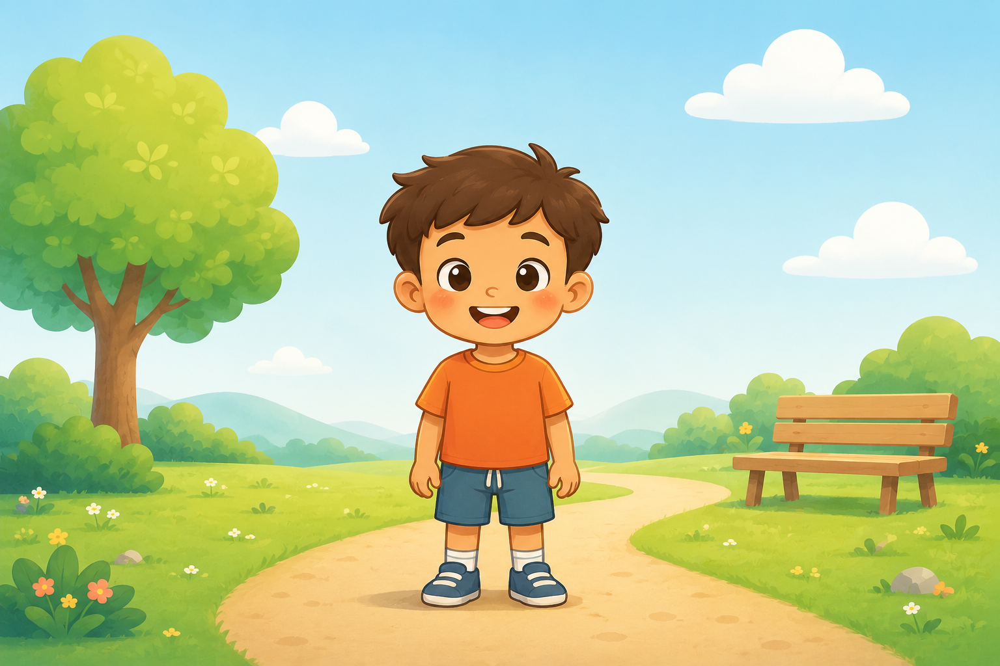
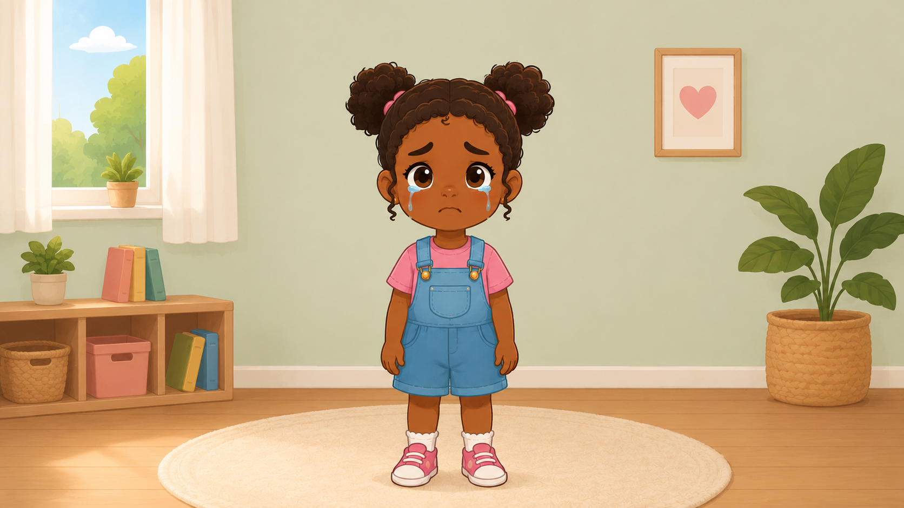
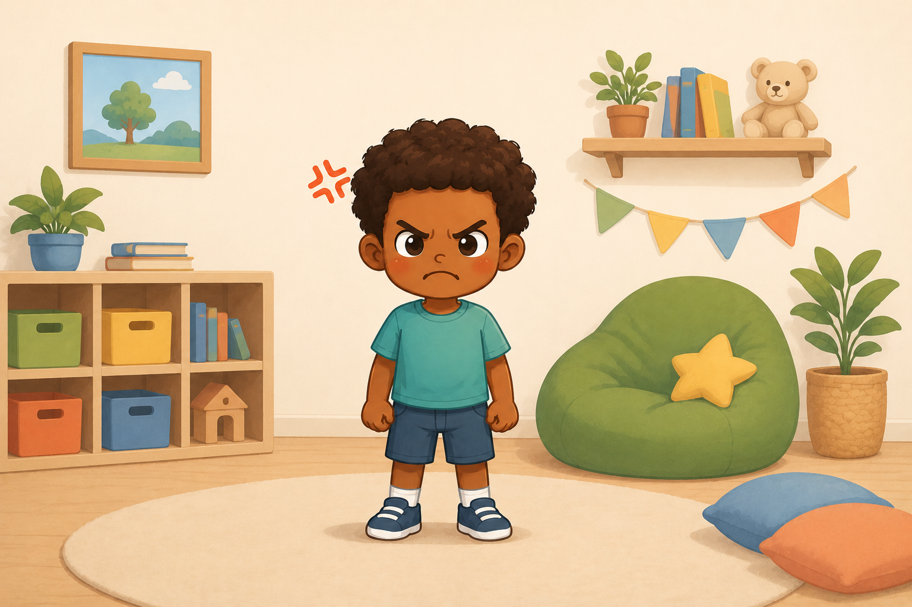
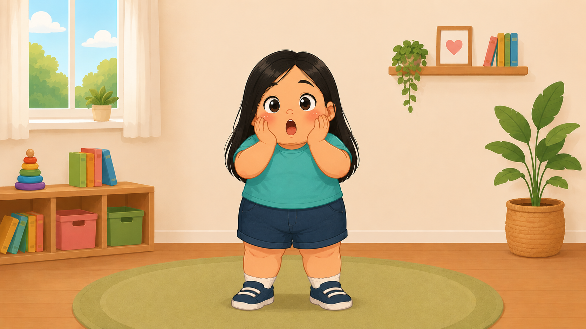

# TEA Educational Game 🎮

Educational game developed in Godot to support emotional recognition and routine learning for children with Autism Spectrum Disorder (ASD), focusing on accessibility, low sensory stimulation and user-friendly interaction.

---

# 📚 About the Project

This project was developed as a final graduation project in Computer Engineering.

The objective is to create an accessible and interactive educational game capable of assisting children with Autism Spectrum Disorder through visual stimuli, emotional recognition and playful learning.

The game was designed with accessibility and sensory comfort in mind, providing a calm and intuitive environment for children.

---

# 🎯 Main Features

- Emotional recognition activities
- Routine learning assistance
- Interactive educational mini-games
- Child-friendly interface
- Low sensory stimulation
- Accessible interaction design

---

# 🛠 Technologies Used

- Godot Engine
- GDScript
- Git & GitHub
- Canva
- Figma

---

# 🚀 Future Improvements

- Voice interaction
- Adaptive difficulty system
- AI-assisted learning
- Progress tracking
- Mobile support

---

# 👨‍💻 Author

Raphael Ribeiro  
Computer Engineering Student
---

# 🖼 Screenshots

## Main Menu

---

## Happy Emotion

---

## Sad Emotion

---

## Angry Emotion

---

## Surprised Emotion

---

## Final Screen

